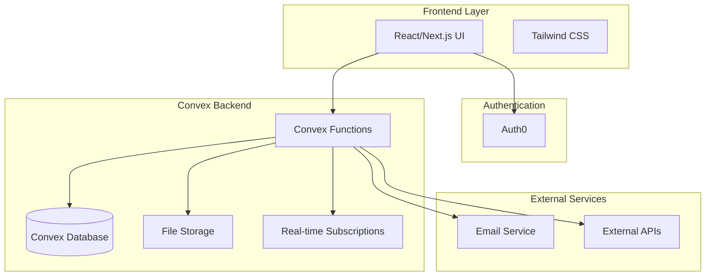
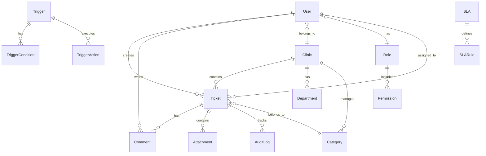

# Design Document

## Overview

Il sistema di gestione ticket per cliniche sanitarie è progettato come una web app moderna e scalabile utilizzando Convex come backend e Tailwind CSS per lo styling. L'architettura è modulare, orientata ai microservizi e ottimizzata per supportare fino a 3000 utenti con oltre 1500 attivi contemporaneamente.

### Tech Stack
- **Frontend**: React/Next.js con Tailwind CSS
- **Backend**: Convex (backend-as-a-service)
- **Database**: Convex Database (NoSQL)
- **Autenticazione**: Auth0
- **Real-time**: Convex real-time subscriptions
- **File Storage**: Convex file storage
- **Notifiche**: Convex actions + email service integration

## Architecture

### High-Level Architecture



### Database Schema Design



## Components and Interfaces

### Core Components

#### 1. Authentication Module
```typescript
interface AuthService {
  login(credentials: LoginCredentials): Promise<AuthResult>
  logout(): Promise<void>
  getCurrentUser(): Promise<User | null>
  refreshToken(): Promise<string>
}

interface User {
  id: string
  email: string
  name: string
  clinicId: string
  roleId: string
  permissions: Permission[]
  isActive: boolean
  createdAt: number
  updatedAt: number
}
```

#### 2. Ticket Management
```typescript
interface Ticket {
  id: string
  title: string
  description: string
  status: TicketStatus
  priority: Priority
  categoryId: string
  clinicId: string
  creatorId: string
  assigneeId?: string
  visibility: 'public' | 'private'
  customFields: Record<string, any>
  slaDeadline?: number
  createdAt: number
  updatedAt: number
}

interface TicketService {
  createTicket(data: CreateTicketData): Promise<Ticket>
  updateTicket(id: string, data: UpdateTicketData): Promise<Ticket>
  assignTicket(ticketId: string, assigneeId: string): Promise<void>
  getTicketsByClinic(clinicId: string, filters?: TicketFilters): Promise<Ticket[]>
  getMyTickets(userId: string): Promise<Ticket[]>
}
```

#### 3. Role and Permission System
```typescript
interface Role {
  id: string
  name: string
  description: string
  clinicId?: string // null for global roles
  permissions: Permission[]
  isSystem: boolean // true for default roles
}

interface Permission {
  id: string
  resource: string // 'tickets', 'users', 'settings', etc.
  action: string // 'read', 'write', 'delete', 'approve'
  scope: 'own' | 'clinic' | 'global'
}
```

#### 4. Automation Engine
```typescript
interface Trigger {
  id: string
  name: string
  clinicId: string
  conditions: TriggerCondition[]
  actions: TriggerAction[]
  isActive: boolean
  requiresApproval: boolean
  createdBy: string
}

interface TriggerCondition {
  field: string
  operator: 'equals' | 'contains' | 'greater_than' | 'less_than'
  value: any
  logicalOperator?: 'AND' | 'OR'
}
```

### Frontend Components Architecture

#### 1. Layout Components
- `AppLayout`: Main application wrapper
- `Sidebar`: Navigation and quick actions
- `Header`: User info, notifications, search
- `Dashboard`: Role-specific dashboard container

#### 2. Feature Components
- `TicketList`: Configurable ticket display
- `TicketForm`: Create/edit ticket form
- `TicketDetail`: Full ticket view with comments
- `UserManagement`: Admin user management
- `RoleEditor`: Permission configuration
- `TriggerBuilder`: Visual automation builder

#### 3. Shared Components
- `DataTable`: Sortable, filterable table
- `SearchBar`: Global search functionality
- `NotificationCenter`: Real-time notifications
- `FileUpload`: Drag-and-drop file handling

## Data Models

### Core Entities

#### Users and Authentication
```typescript
// Convex schema
export const users = defineTable({
  email: v.string(),
  name: v.string(),
  clinicId: v.id("clinics"),
  roleId: v.id("roles"),
  auth0Id: v.string(),
  isActive: v.boolean(),
  lastLoginAt: v.optional(v.number()),
  preferences: v.object({
    notifications: v.object({
      email: v.boolean(),
      push: v.boolean(),
    }),
    dashboard: v.object({
      defaultView: v.string(),
      itemsPerPage: v.number(),
    }),
  }),
})
.index("by_clinic", ["clinicId"])
.index("by_auth0", ["auth0Id"])
.index("by_email", ["email"]);
```

#### Tickets
```typescript
export const tickets = defineTable({
  title: v.string(),
  description: v.string(),
  status: v.union(
    v.literal("new"),
    v.literal("open"),
    v.literal("in_progress"),
    v.literal("resolved"),
    v.literal("closed")
  ),
  priority: v.union(
    v.literal("low"),
    v.literal("medium"),
    v.literal("high"),
    v.literal("urgent")
  ),
  categoryId: v.id("categories"),
  clinicId: v.id("clinics"),
  creatorId: v.id("users"),
  assigneeId: v.optional(v.id("users")),
  visibility: v.union(v.literal("public"), v.literal("private")),
  customFields: v.any(),
  slaDeadline: v.optional(v.number()),
  tags: v.array(v.string()),
})
.index("by_clinic", ["clinicId"])
.index("by_creator", ["creatorId"])
.index("by_assignee", ["assigneeId"])
.index("by_status", ["status"])
.index("by_sla", ["slaDeadline"]);
```

#### Clinics and Organization
```typescript
export const clinics = defineTable({
  name: v.string(),
  code: v.string(), // unique identifier
  address: v.string(),
  phone: v.string(),
  email: v.string(),
  settings: v.object({
    allowPublicTickets: v.boolean(),
    requireApprovalForCategories: v.boolean(),
    defaultSlaHours: v.number(),
  }),
  isActive: v.boolean(),
})
.index("by_code", ["code"]);

export const departments = defineTable({
  name: v.string(),
  clinicId: v.id("clinics"),
  managerId: v.optional(v.id("users")),
  isActive: v.boolean(),
})
.index("by_clinic", ["clinicId"]);
```

## Error Handling

### Error Types and Handling Strategy

#### 1. Authentication Errors
```typescript
class AuthenticationError extends Error {
  constructor(message: string, public code: string) {
    super(message);
  }
}

// Handling in Convex functions
export const authenticatedMutation = mutation({
  handler: async (ctx, args) => {
    const identity = await ctx.auth.getUserIdentity();
    if (!identity) {
      throw new ConvexError("Authentication required");
    }
    // Continue with authenticated logic
  }
});
```

#### 2. Permission Errors
```typescript
class PermissionError extends Error {
  constructor(
    message: string,
    public resource: string,
    public action: string
  ) {
    super(message);
  }
}

// Permission checking utility
async function checkPermission(
  ctx: QueryCtx | MutationCtx,
  resource: string,
  action: string,
  targetId?: string
) {
  const user = await getCurrentUser(ctx);
  const hasPermission = await userHasPermission(user, resource, action, targetId);
  
  if (!hasPermission) {
    throw new ConvexError(`Insufficient permissions for ${action} on ${resource}`);
  }
}
```

#### 3. Validation Errors
```typescript
// Input validation with Convex validators
export const createTicket = mutation({
  args: {
    title: v.string(),
    description: v.string(),
    categoryId: v.id("categories"),
    priority: v.union(v.literal("low"), v.literal("medium"), v.literal("high"), v.literal("urgent")),
  },
  handler: async (ctx, args) => {
    // Additional business logic validation
    if (args.title.length < 3) {
      throw new ConvexError("Title must be at least 3 characters long");
    }
    
    const category = await ctx.db.get(args.categoryId);
    if (!category) {
      throw new ConvexError("Invalid category");
    }
    
    // Continue with creation logic
  }
});
```

### Frontend Error Handling
```typescript
// Error boundary component
class ErrorBoundary extends React.Component {
  state = { hasError: false, error: null };
  
  static getDerivedStateFromError(error: Error) {
    return { hasError: true, error };
  }
  
  render() {
    if (this.state.hasError) {
      return <ErrorFallback error={this.state.error} />;
    }
    return this.props.children;
  }
}

// API error handling hook
function useErrorHandler() {
  const showNotification = useNotification();
  
  return useCallback((error: Error) => {
    if (error instanceof ConvexError) {
      showNotification({
        type: 'error',
        message: error.message,
      });
    } else {
      showNotification({
        type: 'error',
        message: 'An unexpected error occurred',
      });
    }
  }, [showNotification]);
}
```

## Testing Strategy

### 1. Unit Testing
- **Convex Functions**: Test business logic with Convex testing utilities
- **React Components**: Jest + React Testing Library
- **Utility Functions**: Jest for pure functions

### 2. Integration Testing
- **API Integration**: Test Convex function interactions
- **Auth Flow**: Test Auth0 integration
- **Real-time Features**: Test subscription updates

### 3. End-to-End Testing
- **User Workflows**: Playwright for critical user journeys
- **Cross-browser**: Test on major browsers
- **Mobile Responsive**: Test responsive design

### 4. Performance Testing
- **Load Testing**: Simulate 1500+ concurrent users
- **Database Performance**: Query optimization testing
- **Real-time Scalability**: WebSocket connection limits

### Testing Structure
```
tests/
├── unit/
│   ├── convex/
│   │   ├── tickets.test.ts
│   │   ├── users.test.ts
│   │   └── automation.test.ts
│   ├── components/
│   │   ├── TicketList.test.tsx
│   │   ├── Dashboard.test.tsx
│   │   └── UserManagement.test.tsx
│   └── utils/
│       ├── permissions.test.ts
│       └── validation.test.ts
├── integration/
│   ├── auth.test.ts
│   ├── ticket-workflow.test.ts
│   └── real-time.test.ts
└── e2e/
    ├── user-journey.spec.ts
    ├── agent-workflow.spec.ts
    └── admin-management.spec.ts
```

### Performance Optimization

#### 1. Database Optimization
- **Indexing Strategy**: Comprehensive indexes for common queries
- **Query Optimization**: Efficient Convex queries with proper filtering
- **Caching**: Leverage Convex's built-in caching mechanisms

#### 2. Frontend Optimization
- **Code Splitting**: Route-based and component-based splitting
- **Lazy Loading**: Defer non-critical components
- **Memoization**: React.memo and useMemo for expensive operations
- **Virtual Scrolling**: For large ticket lists

#### 3. Real-time Optimization
- **Selective Subscriptions**: Subscribe only to relevant data
- **Debouncing**: Prevent excessive updates
- **Connection Management**: Efficient WebSocket handling

### Security Considerations

#### 1. Authentication Security
- **Token Management**: Secure Auth0 token handling
- **Session Management**: Proper session timeout and refresh
- **Multi-factor Authentication**: Support for MFA

#### 2. Authorization Security
- **Principle of Least Privilege**: Minimal required permissions
- **Resource-level Security**: Check permissions at data level
- **Audit Logging**: Comprehensive action logging

#### 3. Data Security
- **Input Sanitization**: Prevent XSS and injection attacks
- **File Upload Security**: Validate and scan uploaded files
- **Data Encryption**: Encrypt sensitive data at rest

#### 4. API Security
- **Rate Limiting**: Prevent abuse and DoS attacks
- **Input Validation**: Strict validation on all inputs
- **Error Handling**: Don't expose sensitive information in errors